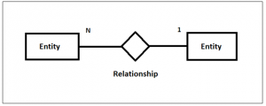

# Technical description:
[MVVM pattern](https://developer.android.com/jetpack/guide#overview) used for app architecture. Following the most important principle of SoC (separation of concerns).

Coroutines in charge for data communication between architectural parts and implemented in following way:
 - Data communication between UI and ViewModel with LiveData in main thread. 
 - Communication between ViewModel and Repository with Flow in IO thredd and collected with LiveData
 

Data fetched from https://jsonplaceholder.typicode.com/ with Retrofit library in conjunction with REST API. Pictures comes from different source: https://source.unsplash.com/collection/542909/ .
All WEB data is cached in local disc with ROOM DAO. Post details are fetched from different source of tables therefore relational table in play (many to one) to make things simple.

During production time after flow implementation in IO thread app crashed without any error message. Crashes appear with Pixel 2 API R only, app switched off after 9sec. when post details loaded. With Pixel 2 API 27 was stable. Takes some time to figure out the root of cause and it was Glide library. Therefore testes other picture loading libraries: Picasso and Coil. Both of them didn't crash the app and finally  decided  to keep Coil.

# Features:
*	Loads data from WEB
*	Data cache in local disc
*	List of posts in recyclceview
*	Post details
*	Animation between fragments transition

# Screens

# Libraries:
*	Kotlin Flow
*	Kotlin LiveData
*	Kotlin Coroutines
*	Hilt
*	Room Dao
*	Retrofit
*	Glide
*	Navigation component
